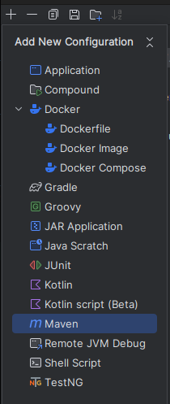
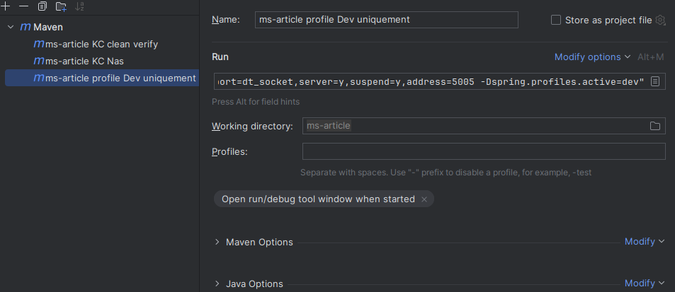

# API de Gestion d'Articles

Bienvenue dans l'API de Gestion d'Articles, une solution puissante pour la création, la modification et la mise à jour
d'articles sur votre site web.

## Table des matières

* [Fonctionnalités principales](#fonctionnalités-principales)
* [Configuration et dépendances](#configuration-requise)
    * [Étapes de Configuration](#étapes-de-configuration)
    * [Les dépendances externes](#les-dépendances-externes)
* [Compilation et déploiement](#compilation-et-déploiement)
  * [Les Phases de compilation](#les-phases-de-compilation)
  * [Les Scripts](#les-scripts)
  * [Scenarios de deployment](#scenarios-de-deployment)
* [Intégration avec ms-gateway](#intégration-avec-ms-gateway)
    * [Accès via ms-gateway](#accès-via-ms-gateway)
    * [Accès Direct par Adresse IP](#accès-direct-par-adresse-ip)
    * [Postman](#postman)
* [Mode Débogage](#mode-débogage)


## Documentation

La documentation complète de l'API est disponible dans le dossier [docs](/docs TODO). Vous y trouverez des informations
détaillées sur l'installation, les points d'extrémité, des exemples pratiques, et bien plus encore.

## Fonctionnalités principales

`Création d'Articles `: Permet aux utilisateurs d'ajouter de nouveaux articles via le site web en utilisant des requêtes
simples.

`Modification d'Articles` : Offre la flexibilité nécessaire pour mettre à jour le contenu des articles existants en
fonction des besoins des utilisateurs.

`Mise à Jour d'Articles` : Fournit des mécanismes pour mettre à jour les informations des articles, garantissant une
gestion précise et à jour du contenu.

`Affichage d'Articles` : Permet aux sites web d'afficher facilement les articles stockés dans la base de données,
offrant ainsi une expérience utilisateur fluide.

## Configuration Requise

Avant de commencer, assurez-vous simplement que vous disposez d'un environnement compatible avec `Java` et `Maven`.
Cette API a été développée avec `Spring Boot version 2.4.5`, et Maven se chargera automatiquement de l'importation des
dépendances spécifiées dans le fichier `pom.xml`.

### Étapes de Configuration

1. Assurez-vous que Maven et importer les dépendances et soit prête à fonctionner.
2. Assurez-vous que l'API `ms-configuration` soit en cours d'exécution et accessible.
3. Lancement de l'API
    * `run.sh` : Il permet d'exécuter la compilation est l'exécution de L'API [voir les scripts](#les-scripts)
    * `Maven`  : Dans l'interface graphique de l'IDE intellij, vous pouvez créer une configuration en mode
      debug [voir Mode Débogage ](#mode-débogage)

### Les dépendances externes

C'est dependence externe sont indispensables et obligatoires pour le fonctionnement de ce projet.

[docker-keycloak-postgres](https://github.com/MGNetworking/docker-keycloak-postgres) : Vous aurais besoin du
projet. Il doit être en cours d'exécution dans l'environnement d'écrit dans le fichier de properties. Ce projet est en
gestion des autorisations utilisateur pour la création, la mise à jour des articles du site. Ce projet est utilisé
pendant la phase de test unitaire, il est donc obligatoire et doit être opérationnelle pour l'utilisation de l'API
ms-article.

[ms-configuration](https://github.com/MGNetworking/ms-configuration) : Ce projet fait partie du
projet principal [back-end](https://github.com/MGNetworking/back-end) qui regroupe toutes les API de ce projet, il
possède comme ce projet son propre depôt.

## Compilation et déploiement

### Les Phases de compilation

1. phase 1 :  
   Cette phase permet de compiler les sources en utilisant les Maven goals.

Exemple de compilation pour le serveur Nas :

```shell
mvn clean package -Dspring.profiles.active=nas -DIP=192.168.1.56 -DSERVICE_CONFIG_DOCKER=${SERVICE_CONFIG_URI}
```

* `-Dspring.profiles.active=nas`  
  La spécification du profile permet au service de récupérer le fichier de properties en correspondance avec
  son environnement. Il est indispensable a la création du build mes aussi dans le étapes du deployment.
  Tout foi, pour le déployment, il lui aussi lui spécifier (voir cela dans 3 phase)


* `-DSERVICE_CONFIG_DOCKER=${SERVICE_CONFIG_URI}`  
  Cette variable permet de localiser le service qui possède le fichier de properties. Sans cette adresse
  il ne peut contacté le service pour récupérer son fichier de properties qui lui ai indispensable.


* `-DIP=192.168.1.56`  
  Cette variable permet de définir l'adresse IP la base de données. Cette données est récupérer puis ajouté au variable
  d'environnement pour être données au fichier de `.properties`

NB: La variable `-DIP` est nécessaire uniquement pour :   
    _ La phase de compilation `Maven` dans le context Nas par l'intermédiaire du fichier `msarticle-nas.properties`  
    _ Le déploiement `Swarm` dans le context Nas par l'intermédiaire du fichier `docker-compose-swarm.yml` 


2. phase 2 :  
   Après la compilation, l'image et construite en utilisant le fichier docker compose dédier a cette effet.
   Le docker compose référence le Dockerfile qui permet la construction de l'image. Si l'image est présent dans votre
   environnement la construction ne sera pas réaliser. L'image est en suite construit en couches dans lesquels sont
   copier les scripts d'exécution et le jar précédemment compiler.

NB: Ce docker compose permet unique de build votre image docker avec la version et le port que vous aurais choisi

3. phase 3 :  
   Après la construction de l'image, celle-ci peut être déployer dans stack. Un docker compose prévu a cette et
   configurer dans le but de paramètre sa mise jours (update_config) ainsi que la possible de retour en arriére (
   rollback_config). Aussi dans la configuration du docker compose un mécanisme de vérification de santé (healthcheck) y
   est configurer.

Exemple de deployment :

```shell
export $(cat .env) && docker stack deploy -c ./docker-compose-swarm-nas.yml article
```

* `export $(cat .env)`
  Permet export les variables contenu dans le fichier `.env`. Cela permet une souplesse dans le déployment de la stack
  A noté que pour serveur Nas l'export des variables ne fonctionne pas, même le variable d'environnement du docker
  compose ne fonctionne pas.
  Cette spécificité est unique au Nas Synology. Par contre, les serveurs Ubuntu n'ont pas cette restriction.

Le reste de la commande cible le docker compose en charge du déployment. Il contient la configuration Swarm permettent
la gestion de la stack qui contient vos service.

Les services contenu dans le stack `article` sont lancer via un script `wait_for_config.sh` qui comme son nom l'indique
Attente que le service configuration soit en cours d'exécution avant de lancer le `Jar` exécutable.

## Intégration avec ms-gateway

Cette API fonctionne au travers du micro-service [ms-gateway](https://github.com/MGNetworking/ms-gateway). Cette API
fait parti du projet principal [back-end](https://github.com/MGNetworking/back-end). Cependant, elle peut également être
accessible directement par son adresse IP.

### Accès via ms-gateway

L'accès à cette API via `ms-gateway`, suit le modèle standard de routage au sein de notre architecture micro-services.
Consultez la documentation de [ms-gateway](https://github.com/MGNetworking/ms-gateway) pour obtenir des informations
spécifiques sur la configuration des routes.

### Accès Direct par Adresse IP

Si nécessaire, vous pouvez accéder directement à cette API en utilisant son adresse IP. Assurez-vous que les règles de
pare-feu et de sécurité appropriées sont en place.

### Postman

Pour simplifier l'interaction avec l'API pour le test en développement, dans le dossier Postman Collection, vous
trouverez le fichier `REST API  ms-article.postman_collection.json`. Vous pouvez l'importé dans votre environnement
Postman.

Il contient une description d'utilisation et des exemples de requêtes pour les principaux points de terminaison de l'
API `ms-article`.

## Les Scripts

Les scripts `run.sh` et `down.sh` ont été créer dans le but de facilité l'exécution du projet en environment Swarm DEV,
mais pas pour le mode debug. Ils ont pour objectif de test l'exécution de l'API dans l'infrastructure Docker Swarm de
manière plus simple et rapide.

* `run.sh` : Au lancement de ce script, vous avez 2 choix possible :

    * La Compilation complète puis le Run de la stack :  
      Pour la compilation complète, vous devez avoir Maven dans votre environnement est le JDK 1.8 de Java.
      le script lancera la compilation via Maven et votre JDK avec les variables d'environnement nécessaire son
      exécution.
      Après la création du Jar, le docker compose responsable de la création de l'image, copiera les fichiers scripts
      ainsi que le Jar nouvellement créer dans les couches de l'image Docker. Cela permet d'avoir une image d'API plus
      légère et donc optimisée.
      Après la création de l'image Docker, le docker compose Swarm, reasonable de la création de la stack, lancera la
      création de la stack.

    * Le Run de la stack :  
      Cette possibilité est à utiliser dans le cas ou vous avez déjà créé l'image et donc que vous n'avez plus qu'a
      créé la stack. Cela permet de gagner du temps quand vous testez l'application est que vous supprimez la stack
      uniquement


* `down.sh` : Au lancement de ce script, vous avez 2 choix possible :

    * Supprimer la stack : Si vous avez besoin de supprimer la stack uniquement.

    * Supprimer la stack et l'image : Si vous avez besoin de supprimer la stack et l'image du système. Avec cela vous
      aurai aussi la suppression des images sans étiquette.


* `deploy.sh` : Ce script est utilise pour déployer le service. Il est utilise dans le script
  `run.sh` mais aussi et surtout dans le `Jenkinsfile`.

Voici le script :

```shell
#!/bin/bash

echo "export des variables "
export $(cat .env)

echo "déploiement / update de la stack : $STACK_NAME"
echo "PROFILES : $PROFILES"

# le déploiement sur le nas
if [ "$PROFILES" == "nas" ]; then
  echo "deploy with PROFILES : nas"
  /usr/local/bin/docker stack deploy -c ./docker-compose-swarm.yml $STACK_NAME
else
  echo "deploy with PROFILES : $PROFILES"
  docker stack deploy -c ./docker-compose-swarm.yml $STACK_NAME
fi
```

La vairable `PROFILES` est binder vers le docker compose pour utilisé en tant que variable d'environnement.
Cela permet de lancer l'API avec le profile utilisateur recherché.

* `wait_for_config.sh` : Ce script est utilisé dans le context Swarm docker. Il permet de vérifier que le service
  `ms-configuration` soit bien en cours d'exécution. En effet, ce service contient les fichiers `.properties`
  nécessaires a execution de l'application. Sans ce service, l'API ne peut être lancer. Ce script est ajouté pendant la
  phase de construction de l'image Docker avec d'autre script.
  Son objectif est d'attendre que le service `ms-configuration` soit en cours d'exécution. Tant qu'il n'est pas en cours
  d'exécution, pas de RUN de l'API.

NB : Le service `ms-configuration` est aussi important pendant la phase de compilation. Sans son fichier de
configuration, il ne peut n'y compiler n'y s'exécuter !!!

voici le script :

```shell
#!/bin/bash

echo  "Lancement du script wait_for_config en cours ... "

# Dans le cas d'un déployement sur le nas
if [ -z "$PROFILE_ACTIF_SPRING" ] || [ -z "$SERVICE_CONFIG_DOCKER" ] || [ -z "$IP"  ]; then

  echo  "Les variables de configuration sont absente, initialisation Nas lancer"

  echo "La variable PROFILE_ACTIF_SPRING => $PROFILE_ACTIF_SPRING <="
  echo "L'adresse IP du service configuration sur le réseau Overlay: $SERVICE_CONFIG_DOCKER <="
  echo "valeur de l'adresse IP de connection à la base de données  $IP <="

  PROFILE_ACTIF_SPRING=nas
  IP=172.17.0.1
  SERVICE_CONFIG_DOCKER=http://ms-configuration:8089

  echo  "Les variables de configuration sont initialiser"
  echo "La variable PROFILE_ACTIF_SPRING => $PROFILE_ACTIF_SPRING <="
  echo "L'adresse IP du service configuration sur le réseau Overlay: $SERVICE_CONFIG_DOCKER <="
  echo "valeur de l'adresse IP de connection à la base de données  $IP <="
fi


  while true; do
    response=$(curl -s $SERVICE_CONFIG_DOCKER/msarticle/$PROFILE_ACTIF_SPRING)

    echo "request vers : $SERVICE_CONFIG_DOCKER/msarticle/$PROFILE_ACTIF_SPRING"

    echo "**********************************"
    echo "Liste des variables d'environnment"
    env
    echo "**********************************"

    if [ -n "$response" ]; then
      echo "Le service ms-configuration est en cours d'exécution."
      echo "Lancement du service ms-article ..."
      java -jar app.jar --spring.profiles.active=$PROFILE_ACTIF_SPRING --IP=$IP

      break  # Sortir de la boucle si le service est opérationnel
    else
      echo "Le service ms-configuration n'est pas encore opérationnel !"
      sleep 3
    fi

  done
```

On peut voir en debut de script, la gestion du cas spéciale Nas. En effet, comme dit précédemment, le Nas ne permet pas
la récuperation des variables d'environnement. Donc, ce cas gérer en dure dans le script pour cette unique raison.

Le reste du script permet d'attendre que le service configuration soit encours d'exécution. Cela est très utilise l'or
de redémarrage du serveur. Pour rappeler si le service est lancer sans sa configuration il tombera en échec et restera
bloquer dans cette état.

A note que la variable `--IP=$IP` est uniquement utilise pour le serveur Nas. Elle est récupérer par le fichier de
properties dédier au Nas uniquement est n'a aucun impacte sur les autres Workflow .

* `healthcheck.sh` : Dans le fichier docker compose Swarm, responsable de la création de la stack, la gestion de la
  santé du service y est configuré. Ce script est utilisé dans ce but. Il exécute une requête curl via l'adresse Ip du
  service dans le context Swarm pour récupérer la santé de celui-ci. Un fichier de log y est disponible
  dans `/app/logs/healthcheck.log`

voici le script :

```shell
#!/bin/sh

## le fichier de log dans le conteneur ou service 
logs="/app/logs/healthcheck.log"
exec > "$logs" 2>&1

## Récupérer l'adresse IP de l'interface eth1
IP=$(ifconfig eth1 | awk '/inet / {gsub(/addr:/, "", $2); print $2}')

echo  "script healthcheck en cours ... "
tentative=0
while [ $tentative -lt 5 ]; do

  echo  "Adresse IP service : $IP "
  echo  "request : http://$IP:9010/actuator/health "

  status=$(curl -s -m 5 http://$IP:9010/actuator/health | jq -r '.status' )
  echo " Résultat de la requête curl : $status"

  if [ "$status" = "UP" ]; then
    echo  "success du script de santé : $status"
    exit 0  # Succès
  elif [ "$status" = "DOWN" ]; then
    echo  "Échec du script de santé : $status"
    exit 1  # Échec 1
  else
    echo  "tentative : $tentative"
    tentative=$((tentative + 1))
    sleep 3
  fi
done
```

## Mode Débogage

Si vous avez besoin de déboguer l'API, suivez ces étapes pour configurer un environnement de débogage :

Dans intellij, aller vers éditer une configuration, puis ajoute avec le plus et sélectionner Maven



Cela ajoutera un onglet supplémentaire qu'il vous faudra configurer.



| Goal    | description                                                                                 |
|---------|---------------------------------------------------------------------------------------------|
| clean   | Supprime les fichiers générés lors des précédentes builds                                   |
| compile | Compile le code source du projet                                                            |
| test    | Exécute les tests unitaires du projet                                                       |
| package | Crée un package du projet, par exemple un fichier JAR ou WAR                                |
| install | Installe le package dans le référentiel Maven local.                                        |
| deploy  | Déploie le package dans un référentiel distant.                                             |
| site    | Génère un site Web pour le projet à partir des informations de documentation et de rapport. |

[Maven](https://maven.apache.org/guides/introduction/introduction-to-the-lifecycle.html) est basé sur le concept central
d'un cycle de vie de build. Cela signifie que le processus de construction et de distribution d'un artefact (projet)
particulier est clairement défini.

Dans l'espace Run ajoute la commande :

Sans la mode debug

```shell
# context devlocal
clean test -Dspring.profiles.active=devlocal -DSERVICE_CONFIG_DOCKER=http://192.168.1.68:8089 spring-boot:run "-Dspring-boot.run.jvmArguments=-Dspring.profiles.active=devlocal -DSERVICE_CONFIG_DOCKER=http://192.168.1.68:8089"
# ancien context dev
clean test -Dspring.profiles.active=dev -DSERVICE_CONFIG_DOCKER=http://192.168.1.68:8089  spring-boot:run -Dspring-boot.run.jvmArguments="-Dspring.profiles.active=dev -DSERVICE_CONFIG_DOCKER=http://192.168.1.68:8089" 
```

Avec mode debug

```shell
# context devlocal
clean test -Dspring.profiles.active=devlocal -DSERVICE_CONFIG_DOCKER=http://192.168.1.68:8089 spring-boot:run -Dspring-boot.run.jvmArguments="-Xdebug -Xrunjdwp:transport=dt_socket,server=y,suspend=y,address=5005 -DSERVICE_CONFIG_DOCKER=http://192.168.1.68:8089 -Dspring.profiles.active=devlocal"
# ancien context dev
clean test -Dspring.profiles.active=dev -DSERVICE_CONFIG_DOCKER=http://192.168.1.68:8089 spring-boot:run -Dspring-boot.run.jvmArguments="-Xdebug -Xrunjdwp:transport=dt_socket,server=y,suspend=y,address=5005 -DSERVICE_CONFIG_DOCKER=http://192.168.1.68:8089 -Dspring.profiles.active=dev"
```

Note que le profile est `devlocal`. cette environnement correspond votre environnement locale. c'est dire qu'il
que le fichier de properties en correspondance contient la localisation de keycloak et postgres dans votre sur votre
machine.

Il n'appartient pas au context docker n'y même docker Swarm. Pour testé l'environnement Docker Swarm, les
scripts `run.sh` et `down.sh` sont dédier a cette effet et aucun configuration n'est nécessaire puis qu'il embarque les
3 phase. La création de l'artefact ou l'archive Jar et la création de l'image et le déployment en locale de la stack.

```shell
# commande de base 
mvn spring-boot:run -Dspring-boot.run.jvmArguments="-Xdebug -Xrunjdwp:transport=dt_socket,server=y,suspend=n,address=5005"
```

La commande mvn `spring-boot:run` est principalement utilisée pour exécuter l'application Spring Boot, mais elle ne
déclenche pas automatiquement l'exécution des tests unitaires

Détail de la commande :

1. `clean test` : lance les testes unitaires (goal test)
2. `spring-boot:run` : Le lancement de l'API Spring Boot directement à partir du code source sans générer de fichier
   exécutable (JAR ou WAR) au préalable.
3. `-Dspring-boot.run.jvmArguments` le passage en arguments pour la JVM
4. `-Xdebug -Xrunjdwp:transport=dt_socket,server=y,suspend=y,address=5005`  
   Cette partie de la commande correspond à la configuration du débogueur Java (Java Debugger Wire Protocol - JDWP) pour
   une application Spring Boot.

    * **-Xdebug** : Active le support du débogueur Java.
    * **-Xrunjdwptransport=dt_socket,server=y,suspend=y,address=5005**:
        * **transport=dt_socket**: Spécifie le mode de transport pour la communication entre le débogueur et
          l'application. Dans ce cas, il utilise le socket (dt_socket).
        * **server=y**: Indique que l'application doit agir en tant que serveur pour le débogueur, ce qui signifie
          qu'elle
          attendra une connexion du débogueur.
        * **suspend=y**: Indique que l'application doit être suspendue jusqu'à ce qu'une connexion de débogage soit
          établie. Cela signifie que l'application attendra le débogueur avant de commencer à s'exécuter.
        * **address=5005**: Spécifie le port sur lequel l'application écoutera les connexions du débogueur. Dans ce cas,
          le port est 5005.

5. `-Dspring.profiles.active=devlocal` :  
   Le profile active permet de prècisé l'environnement dans lequel s'execute
   cette API. Cela aura pour effet au moment de l'exécution, de cibler le fichier de properties avec lequel cette API
   va fonctionner et aussi les testes unitaires qui seront exécuter au moment de la compilation.

Working directory : Cible le dossier projet (l'API ms-article)

### Scenarios de deployment

Les scenarios permet de mettre en place l'environnement de connection principalement au tour de la communication entre
le `service ms-article` est le service `registre Eureka`.  
Cette API regroupe deux scenarios lier a leur environnement :

* local
* Swarm

1. Dans le `scenarios local`, l'API ou le service ms-article est déployer sur le système host. Il nécessite les
   configurations suivant :

* La localisation du serveur :

```yaml
eureka.client.service-url.defaultZone=http://192.168.1.68:8099/eureka
```

L'adresse ip d'Eureka sur votre machine

* Indiqué au serveur Eureka registre de privilégier l'utilisation de l'adresse IP lors de l'enregistrement :

```yaml
eureka.instance.preferIpAddress=true
```

* Spécifie un identifiant unique pour l'enregistrement dans Eureka Serveur en utilisant sont nom d'application :

```yaml
spring.application.name=ms-article
eureka.instance.instance-id=${spring.application.name}:${server.port}:${random.value}
```

Ces properties vont permettre au service ms-article de ce connecter au service registre en utilisent l'adresse IP du
service registre Eureka et d'enregistre le service en privilégient l'IP du service ms-article et de créer en identifiant
dans le service registre en ce basent sur nom sont port de connexion et une valeur aléatoire permettent de le distinguer
des autres services ms-article.

2. Dans le `scenarios swarm`, l'API ou le service ms-article est déployer dans un cluster docker Swarm. Il déployer a
   partir d'une image docker. Tous les services deployer au sein de ce cluster peuvent communiqué entre eux par le
   réseau overlay attribuer. Ce scenario nécessite les configurations suivant :


* La localisation du serveur :

```yaml
eureka.client.service-url.defaultZone=http://ms-eureka:8099/eureka
```

Dans notre cas `ms-eureka` représente le nom du service registre. Il sera retrouve par la résolution DNS au sien du
réseau Overlay dans lequel il est déployer.

* Les gestion des interfaces réseau du service. Nous devons privilégier l'interface `eth1` pour connection dans le
  réseau Overlay et aussi ignorer l'interface `eth0` qui est la connection externe du service.

```yaml
spring.cloud.inetutils.ignoredInterfaces=eth0
eureka.instance.network-interface-name=eth1
```

Voici une explication des interfaces réseau couramment présentes dans un conteneur Docker :

`eth0` : C'est l'interface réseau principale du conteneur. Elle est utilisée pour la communication avec d'autres
conteneurs sur le même réseau overlay et avec le monde extérieur.

`eth1, eth2` : Ces interfaces supplémentaires peuvent être créées si votre service utilise des fonctionnalités
spécifiques, comme la mise en réseau multi-hôte. Par exemple, si votre service est configuré pour utiliser des réseaux
overlay avec plusieurs sous-réseaux, Docker peut créer des interfaces réseau supplémentaires pour chaque sous-réseau.

`Lo` : C'est l'interface de bouclage `(loopback)` qui est utilisée pour la communication interne au conteneur lui-même.

* Indiqué au serveur Eureka registre de privilégier l'utilisation de l'adresse IP lors de l'enregistrement :

```yaml
eureka.instance.preferIpAddress=true
```

* Le nom d'hote de l'application :

```yaml
eureka.instance.hostName=ms-article
```

* Spécifie un identifiant unique pour l'enregistrement dans Eureka Serveur en utilisant sont nom d'application qui
  provient de manière accéssoire au nom d'hote :

```yaml
spring.application.name=${eureka.instance.hostName}
eureka.instance.instance-id=${eureka.instance.hostName}:${server.port}:${spring.application.instance_id:${random.value}}
```

Un identifiant unique sera créer a partir des informations donnée dans le but de l'identifier de manière unique au sein
de stack.

Résumer :
Cette configuration permet le `load balancing` via le service Gateway de manière optimum sur chaque instance de service
`ms-article` créer dans le cluster Swarm.
