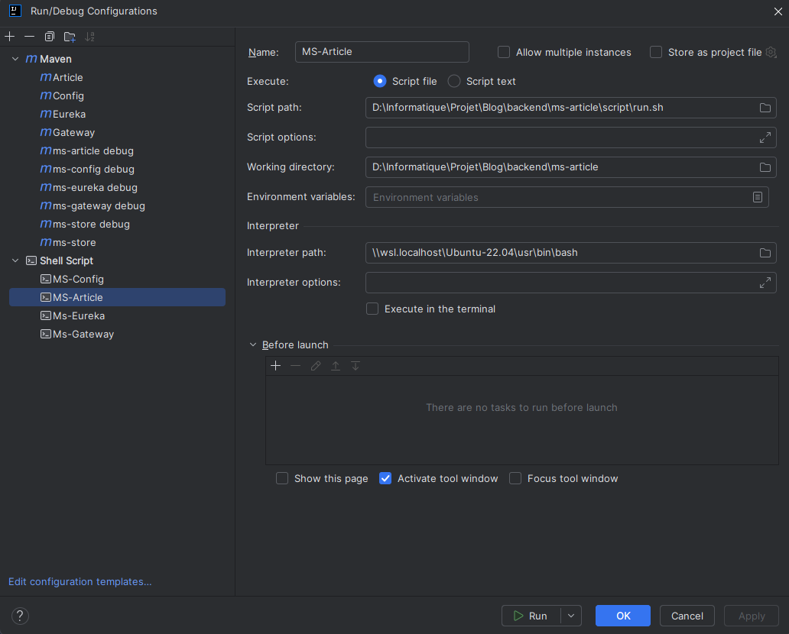

# API de Gestion d'Articles

## Sommaire

* [Fonctionnalités principales](#fonctionnalités-principales)
* [Configuration Requise](#configuration-requise)
    * [Étapes de Configuration](#étapes-de-configuration)
    * [Les dépendances externes](#les-dépendances-externes)
* [Test, Compilation et déploiement](#test-compilation-et-déploiement)
    * [Configuration Maven pour les Tests](#configuration-maven-pour-les-tests)
    * [Les Phases de compilation](#les-phases-de-compilation)
    * [Intégration avec ms-gateway](#intégration-avec-ms-gateway)
    * [Accès via ms-gateway](#accès-via-ms-gateway)
    * [Accès Direct par Adresse IP](#accès-direct-par-adresse-ip)
    * [Postman](#postman)
* [Les Scripts](#les-scripts)
* [Configuration de développement](#configuration-de-développement)
    * [Maven](#maven)
    * [Docker](#docker)
* [Scenarios de deploiement](#scenarios-de-deploiement)

## Objectif

Cette API a pour objectif de fournir une solution complète pour la gestion des articles
de [mon site web](https://ghoverblog.ovh/). Elle permet aux utilisateurs d'enregistrer, de modifier et de supprimer des
articles de manière sécurisée et efficace.

L'API intègre Keycloak pour assurer l'authentification des utilisateurs et gérer l'accès aux différents points de
terminaison. Les règles d'autorisation ont été configurées de manière à ce que chaque utilisateur puisse modifier ou
supprimer uniquement ses propres articles. De plus, les utilisateurs disposant du rôle ADMIN bénéficient de droits
supplémentaires leur permettant de gérer les articles de tous les utilisateurs.

Cette configuration garantit à la fois la sécurité des données et la flexibilité nécessaire pour une gestion adaptée des
contenus par les différents types d'utilisateurs.

## Fonctionnalités principales

* `Création d'Articles `  
  Permet aux utilisateurs d'ajouter de nouveaux articles via le site web en utilisant des requêtes
  simples.

* `Modification d'Articles`  
  Offre la flexibilité nécessaire pour mettre à jour le contenu des articles existants en
  fonction des besoins des utilisateurs.

* `Mise à Jour d'Articles`  
  Fournit des mécanismes pour mettre à jour les informations des articles, garantissant une
  gestion précise et à jour du contenu.

* `Affichage d'Articles`  
  Permet aux sites web d'afficher facilement les articles stockés dans la base de données,
  offrant ainsi une expérience utilisateur fluide.

## Configuration Requise

Avant de commencer, assurez-vous simplement que vous disposez d'un environnement compatible avec `Java` et `Maven`.
Cette API a été développée avec `Spring Boot version 2.4.5`, et Maven se chargera automatiquement de l'importation des
dépendances spécifiées dans le fichier `pom.xml`.

### Étapes de Configuration

1. Assurez-vous que Maven et importer les dépendances et soit prête à fonctionner.
2. Assurez-vous que l'API `ms-configuration` soit en cours d'exécution et accessible.
3. Lancement de l'API
    * `run.sh` : Il permet d'exécuter la compilation est l'exécution de L'API [voir les scripts](#les-scripts)
    * `Maven`  : Dans l'interface graphique de l'IDE intellij, vous pouvez créer une configuration en mode
      debug [voir Mode Débogage ](#mode-débogage)

### Les dépendances externes

C'est dependence externe sont indispensables et obligatoires pour le fonctionnement de ce projet.

[docker-keycloak-postgres](https://github.com/MGNetworking/docker-keycloak-postgres) : Vous aurais besoin du
projet. Il doit être en cours d'exécution dans l'environnement d'écrit dans le fichier de properties. Ce projet est en
gestion des autorisations utilisateur pour la création, la mise à jour des articles du site. Ce projet est utilisé
pendant la phase de test unitaire, il est donc obligatoire et doit être opérationnelle pour l'utilisation de l'API
ms-article.

[ms-configuration](https://github.com/MGNetworking/ms-configuration) : Ce projet fait partie du
projet principal [back-end](https://github.com/MGNetworking/back-end) qui regroupe toutes les API de ce projet, il
possède comme ce projet son propre depôt.

## Test, Compilation et déploiement

### Configuration Maven pour les Tests

Cette configuration Maven permet de gérer et d'exécuter trois types de tests dans un projet Spring Boot :

* Les tests unitaires
* Les tests d'intégration
* Les tests End-to-End (E2E)

#### Structure de la configuration

1. Plugins configurés
    1. Spring Boot Maven Plugin

        * Défini pour exclure certains artefacts comme lombok du processus de construction.
        * Permet d'exécuter une application Spring Boot via Maven.

    2. Maven Surefire Plugin

        * Utilisé pour exécuter les tests unitaires uniquement.
        * Exclut les tests d'intégration (*ITTest.java) et E2E (*E2ETest.java).

    3. Maven Failsafe Plugin

        * Utilisé pour exécuter les tests d'intégration et E2E, généralement après le déploiement dans un environnement
          d'intégration.
        * Contrôle les étapes integration-test et verify.


2. Profils Maven  
   Des profils distincts permettent de déclencher des tests spécifiques en fonction du contexte.

**a) Profil integration**

Exécute uniquement les tests d'intégration.

Configuration :
Désactive les tests unitaires (maven-surefire-plugin).
Active uniquement les fichiers de tests dans `**/integration/*ITTest.java`.

**b) Profil e2e**

Exécute uniquement les tests End-to-End (E2E).

Configuration :  
Désactive les tests unitaires (maven-surefire-plugin).
Active uniquement les fichiers de tests dans `**/endtoend/*E2ETest.java`.

**c) Profil combiné (optionnel)**

Si vous souhaitez exécuter tous les tests (intégration + E2E) dans une seule commande, vous pouvez définir un profil
personnalisé (voir section suivante).

**Utilisation**

1. Exécuter les tests unitaires  
   Les tests unitaires sont exécutés par défaut avec Maven :

````bash
mvn clean test
````

2. Exécuter les tests d'intégration  
   Pour exécuter les tests d'intégration uniquement :

````bash
mvn clean verify -P integration -Dspring.profiles.active=test
````

3. Exécuter les tests End-to-End  
   Pour exécuter les tests E2E uniquement :

````bash
mvn clean verify -P e2e -Dspring.profiles.active=test
````

4. Exécuter tous les tests  
   Si un profil combiné est défini (voir ci-dessous), vous pouvez exécuter tous les tests :

````shell
mvn clean verify -P all-tests -Dspring.profiles.active=test
````

--- 

**Notes importantes**

1. Structure des fichiers de test :

    * unitaires : **/*Test.java
    * Tests d'intégration : **/integration/*ITTest.java
    * Tests E2E : **/endtoend/*E2ETest.java

2. Phases Maven utilisées :

    * test : Exécution des tests unitaires via `maven-surefire-plugin`.
    * integration-test et verify : Exécution des tests d'intégration et E2E via `maven-failsafe-plugin`.

3. Exclusion de Lombok :

    * Le plugin Spring Boot est configuré pour exclure lombok au moment du build afin d'éviter des dépendances inutiles
      dans
      l'environnement de production.

**Commandes rapides**

| Action                  | Commande                                                        |
|-------------------------|-----------------------------------------------------------------|
| Tests unitaires         | `mvn clean test -Dspring.profiles.active=test`                  |
| Tests d'intégration     | `mvn clean verify -P integration -Dspring.profiles.active=test` |
| Tests End-to-End        | `mvn clean verify -P e2e -Dspring.profiles.active=test`         |
| Tous les tests (option) | `mvn clean verify -P all-tests -Dspring.profiles.active=test`   |

### Les Phases de compilation

1. phase 1 :  
   Cette phase permet de compiler les sources en utilisant les Maven goals.

Exemple de compilation pour le serveur Nas :

```bash
mvn clean package -Dspring.profiles.active=nas -DSERVICE_CONFIG_DOCKER=${SERVICE_CONFIG_URI}
```

* `-Dspring.profiles.active=nas`  
  La spécification du profil Spring permet au service, de récupérer son fichier de properties en correspondance avec son
  environnement. Il est indispensable à la compilation.


* `-DSERVICE_CONFIG_DOCKER=${SERVICE_CONFIG_URI}`  
  Cette variable permet de localiser le service qui possède le fichier de properties. Sans cette adresse, il ne peut
  contacter le service pour récupérer son fichier de properties qui lui est indispensable.

Dans cette phase de compilation, sous le profile `nas` le fichier utilisé du fichier `msarticle-nas.properties`.
Ce fichier n'est pas présent dans le projet et récupèrer via Spring config.

2. phase 2 :  
   Après la compilation, l'image docker est créé en utilisant le fichier `docker-compose.yml`.
   Si l'`image:version` n'est pas présent dans l'environnment docker du système, le fichier `Dockerfile` lancera la
   construction de l'image.
   L'image sera ansi construit en couches, avec en copié, les scripts d'exécution et le jar précédemment compiler.

Le fichier `docker-compose.yml` permet UNIQUEMENT la création de l'image docker de ce projet sous la version définit
dans le fichier `.env`

3. phase 3 :  
   Après la construction de l'image, celle-ci peux être déployé dans une stack via le script `deploy.sh`. Le fichier
   `docker-compose-swarm.yml` contient toutes les configurations pour le déploiment et la gestion du service.
   Il est configuré dans le but de paramètre un update, un rollback. Ce fichier possède aussi un mécanisme de
   vérification de santé (healthcheck) lui permettent redémarrer une instance en cas de mauvaise santer du service en
   cours d'exécution dans la stack.

Les services contenus dans la stack `article` sont lancé via un script `wait_for_config.sh` qui comme son nom l'indique
Attente que le service configuration soit en cours d'exécution avant de lancer le `Jar` exécutable.

## Intégration avec ms-gateway

Cette API fonctionne au travers du micro-service [ms-gateway](https://github.com/MGNetworking/ms-gateway). Cette API
fait partie du projet principal [backend](https://github.com/MGNetworking/backend). Cependant, elle peut également être
accessible directement par son adresse IP.

### Accès via ms-gateway

L'accès à cette API via `ms-gateway`, suit le modèle standard de routage au sein de notre architecture micro-services.
Consultez la documentation de [ms-gateway](https://github.com/MGNetworking/ms-gateway) pour obtenir des informations
spécifiques sur la configuration des routes.

### Accès Direct par Adresse IP

Si nécessaire, vous pouvez accéder directement à cette API en utilisant son adresse IP. Assurez-vous que les règles de
pare-feu et de sécurité appropriées sont en place.

### Postman

Pour simplifier l'interaction avec l'API pour le test en développement, dans le dossier Postman Collection, vous
trouverez le fichier `REST API  ms-article.postman_collection.json`. Vous pouvez l'importé dans votre environnement
Postman.

Il contient une description d'utilisation et des exemples de requêtes pour les principaux points de terminaison de
l'API `ms-article`.

## Les Scripts

Les scripts `run.sh` et `down.sh` été conçu dans le but de facilité l'exécution du projet en environment Swarm. Ils ont
pour objectif de test l'exécution de l'API dans l'infrastructure Docker Swarm de manière plus simple et rapide.

Le script `deploy.sh` a été conçu pour automatiser le déploiement de l'API conteneurisée dans un environnement Docker
Swarm. En exécutant ce script, l'API est déployée de manière efficace, garantissant une orchestration optimale des
services au sein du cluster Docker Swarm. Ce script est utilisé aussi bien utilisé pour le développement via le script
`run.sh` que dans les pipelines Jenkins pour le déploiement sur les serveurs.

Le script `wait_for_config.sh` est utilisé dans le context Swarm docker. Il permet d'attendre d'attendre que le service
`ms-configuration` soit en cours d'exécution. En effet, le service `ms-configuration` permet de récupérer les fichiers
`.properties` nécessaires a execution de l'application. Sans ce service, l'API ne pourra récupérer ses properties en
lien avec son profile. Ce script est ajouté pendant la phase de construction de l'image Docker avec d'autre script.

Le script `healthcheck.sh` est responsable de la création de la stack et permet surveiller l'état de santé du
microservice au sein du cluster Docker Swarm.
Il est automatiquement exécuté via la configuration `healthcheck` définie dans le fichier `docker-compose-swarm.yml`.
Grâce à cette configuration, le script vérifie régulièrement le bon fonctionnement du microservice, avec un intervalle,
un délai, ainsi qu'un nombre de tentatives défini dans ce docker compose.

## Configuration de développement

### Maven

Si vous avez besoin de déboguer l'API, suivez ces étapes pour configurer un environnement de débogage. Dans intellij,
aller vers éditer une configuration, puis ajoute avec le plus et sélectionner Maven


Cela ajoutera un onglet supplémentaire qu'il vous faudra configurer.


| Goal    | description                                                                                 |
|---------|---------------------------------------------------------------------------------------------|
| clean   | Supprime les fichiers générés lors des précédentes builds                                   |
| compile | Compile le code source du projet                                                            |
| test    | Exécute les tests unitaires du projet                                                       |
| package | Crée un package du projet, par exemple un fichier JAR ou WAR                                |
| install | Installe le package dans le référentiel Maven local.                                        |
| deploy  | Déploie le package dans un référentiel distant.                                             |
| site    | Génère un site Web pour le projet à partir des informations de documentation et de rapport. |

[Maven](https://maven.apache.org/guides/introduction/introduction-to-the-lifecycle.html) est basé sur le concept central
d'un cycle de vie de build. Cela signifie que le processus de construction et de distribution d'un artefact (projet)
particulier est clairement défini.

Dans l'espace Run ajoute la commande :

Sans la mode debug

```shell
clean test -Dspring.profiles.active=dev -DSERVICE_CONFIG_DOCKER=http://192.168.x.xx:8089 spring-boot:run "-Dspring-boot.run.jvmArguments=-Dspring.profiles.active=devlocal -DSERVICE_CONFIG_DOCKER=http://192.168.1.68:8089" 
```

Avec mode debug

```shell
clean test -Dspring.profiles.active=dev -DSERVICE_CONFIG_DOCKER=http://192.168.1.68:8089 spring-boot:run -Dspring-boot.run.jvmArguments="-Xdebug -Xrunjdwp:transport=dt_socket,server=y,suspend=y,address=5005 -DSERVICE_CONFIG_DOCKER=http://192.168.1.68:8089 -Dspring.profiles.active=dev"
```

Le lancement de l'application Spring Boot

```shell
mvn spring-boot:run -Dspring-boot.run.jvmArguments="-Xdebug -Xrunjdwp:transport=dt_socket,server=y,suspend=n,address=5005"
```

La commande mvn `spring-boot:run` est principalement utilisée pour exécuter l'application Spring Boot, mais elle ne
déclenche pas automatiquement l'exécution des tests unitaires

Détail de la commande :

1. `clean test` : Néttoye puis lance les testes unitaires (goal test)
2. `spring-boot:run` : Le lancement de l'API Spring Boot directement à partir du code source sans générer de fichier
   exécutable (JAR ou WAR) au préalable.
3. `-Dspring-boot.run.jvmArguments` le passage en arguments pour la JVM
4. `-Xdebug -Xrunjdwp:transport=dt_socket,server=y,suspend=y,address=5005`  
   Cette partie de la commande correspond à la configuration du débogueur Java (Java Debugger Wire Protocol - JDWP) pour
   une application Spring Boot.

    * **-Xdebug** : Active le support du débogueur Java.
    * **-Xrunjdwptransport=dt_socket,server=y,suspend=y,address=5005**:
        * **transport=dt_socket**: Spécifie le mode de transport pour la communication entre le débogueur et
          l'application. Dans ce cas, il utilise le socket (dt_socket).
        * **server=y**: Indique que l'application doit agir en tant que serveur pour le débogueur, ce qui signifie
          qu'elle
          attendra une connexion du débogueur.
        * **suspend=y**: Indique que l'application doit être suspendue jusqu'à ce qu'une connexion de débogage soit
          établie. Cela signifie que l'application attendra le débogueur avant de commencer à s'exécuter.
        * **address=5005**: Spécifie le port sur lequel l'application écoutera les connexions du débogueur. Dans ce cas,
          le port est 5005.

5. `-Dspring.profiles.active=dev` :  
   Le profile active permet de prècisé l'environnement dans lequel s'execute
   cette API. Cela aura pour effet au moment de l'exécution, de cibler le fichier de properties avec lequel cette API
   va fonctionner et aussi les testes unitaires qui seront exécuter au moment de la compilation.

Working directory : Cible le dossier projet (l'API ms-article)

### Docker

Pour utiliser le script `run.sh` qui utilise le`down.sh` et aussi `deploy.sh` , il vous faut un exécuté bash. Sous
Windows, vous pouvez utiliser wsl qui un sous système linux dans Windows. Voici un exemple de configuration qui utilise
le script `run.sh`

La partie importante est de localiser l'intépréteur `Bash` de votre wsl, qui reste à vérifier sur votre machine

````bash
\\wsl.localhost\Ubuntu-22.04\usr\bin\bash
````



### Scenarios de deploiement

Les scenarios de deploiement permettent de mettre en place l'environnement au tour de la communication entre les
services.

On distingue deux scenarios,

* `scenarios local` qui utilise l'environnement de l'host
* `scenarios Swarm` qui utilise le réseau virtuel docker et orchestrateur Swarm

1. Dans le `scenarios local`, l'API ou le service ms-article est déployé sur le système host de manière autonome. Il
   nécessite les configurations suivantes :

* La localisation du micro service Eureka:

```yaml
eureka.client.service-url.defaultZone=http://192.168.1.68:8099/eureka
```

* L'adresse ip d'Eureka sur votre machine, qui indiqué au serveur Eureka registre de privilégier l'utilisation de
  l'adresse IP lors de l'enregistrement avec une valeur à `true`

```yaml
eureka.instance.preferIpAddress=true
```

* Spécifie un identifiant unique pour l'enregistrement dans Eureka Serveur en utilisant son nom d'application puis créer
  un identifiant pour le service registre.

```yaml
spring.application.name=ms-article
eureka.instance.instance-id=${spring.application.name}:${server.port}:${random.value}
```

2. Dans le `scenarios swarm`, Les API sont déployées au sein de ce cluster Docker Swarm et sont intégrées dans le même
   réseau overlay. Ce réseau virtuel permet aux services de communiquer entre eux de manière sécurisée et efficace, même
   lorsqu'ils sont répartis sur différents nœuds du cluster. Ce scenario nécessite les configurations suivantes :

* La localisation de l'API Eureka      
  Dans notre cas `ms-eureka` représente le nom du service registre dans le réseau docker Overlay. Il sera localisé par
  son
  nom via la résolution DNS au sien du réseau Overlay dans lequel il est déployé.

```yaml
eureka.client.service-url.defaultZone=http://ms-eureka:8099/eureka
```

* La gestion de la connexion des services en utilisant les interfaces réseau overlay. Nous devons privilégier
  l'interface `eth1` pour connection dans le réseau Overlay et aussi ignorer l'interface `eth0` qui est la connection
  externe du service. Sans cette configuration l'API Article ne pourra s'enregistrer auprès de l'API Eureka et donc
  l'API gateway ne pourra localiser l'API Article afin de lui acheminer les requêtes.

```yaml
spring.cloud.inetutils.ignoredInterfaces=eth0
eureka.instance.network-interface-name=eth1
```

Voici une explication concernant les interfaces réseau couramment présentes dans un conteneur Docker :

`eth0` : C'est l'interface réseau principale du conteneur. Elle est utilisée pour la communication avec d'autres
conteneurs sur le même réseau overlay et avec le monde extérieur.

`eth1, eth2` : Ces interfaces supplémentaires peuvent être créées si votre service utilise des fonctionnalités
spécifiques, comme la mise en réseau multi-hôte. Par exemple, si votre service est configuré pour utiliser des réseaux
overlay avec plusieurs sous-réseaux, Docker peut créer des interfaces réseau supplémentaires pour chaque sous-réseau.

`Lo` : C'est l'interface de bouclage `(loopback)` qui est utilisée pour la communication interne au conteneur lui-même.

* Indiqué au serveur Eureka registre de privilégier l'utilisation de l'adresse IP lors de l'enregistrement :

```yaml
eureka.instance.preferIpAddress=true
```

* Le nom d'hote de l'application :

```yaml
eureka.instance.hostName=ms-article
```

* Spécifie un identifiant unique pour l'enregistrement dans Eureka Serveur en utilisant son nom d'application :

```yaml
spring.application.name=${eureka.instance.hostName}
eureka.instance.instance-id=${eureka.instance.hostName}:${server.port}:${spring.application.instance_id:${random.value}}
```

Résumer :  
Cette configuration permet à l'API Article de s'enregistrer auprès de l'API Eureka. L'API Gateway récupérer, auprès
d'Eureka la liste des API auquel elle doit redistribuer les requêtes. L'API gateway fait office de passerelle pour les
requêtes et aussi de `load balancing` entre les API des stacks déployé dans le cluster Swarm.
